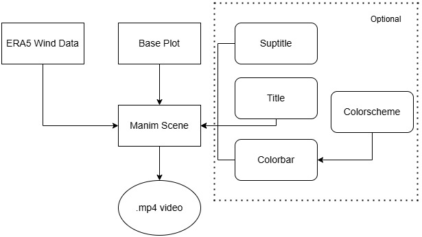

# Lombric Quiver   


| Category | Badge |
|----------|-------|
| **Build** | [](https://pypi.org/project/uv/) 
| **Documentation** | [](https://emanuel-gf.github.io/lombric-quiver/) [](https://deepwiki.com/emanuel-gf/lombric-quiver) |
| **Package Info** |  [](https://pypi.org/project/nickyspatial)   |


A  Python library develop for end-to-end geospatial animations. 
Using a seamless integration with [Earth Data Hub](https://platform.destine.eu/services/service/earth-data-hub/) and [Destination Earth](https://platform.destine.eu/services/service/earth-data-hub/).
Lombric Quiver library allows users to retrieve, pre-process and create Wind animations with one tool. 

<video width="600" controls>
  <source src="img/unicolor.mp4" type="video/mp4">
  Your browser does not support the video tag.
</video>

The library uses as an engine the Manim community, an open-source project initiality developt by [3blue1brown](https://www.youtube.com/c/3blue1brown) to create mathematics and physics animations, Manim was embraced by the community which provided improvements and maintain the library so far. Manim is an animator engine, that uses practices of Orientation Object Programing to create stunning animations. 


##  Project Structure

The project is compouse by four modules, each one has its own functionalities that making the whole wind streamplot video creating smooth and at easy.

* `ERA5_Procesor` - Retrieve and Pre-process geospatial data from ERA5.
* `Colormap` - Allow palette generation .
* `VectorFieldAnimation` - Creates the Scene and animate stream lines.
* `Base plot` - Deals with background plots that belongs to the scene.

## How does it work



The output of lombricquiver is a video on .mp4 format. First, the data is retrieved through [Destination Earth](https://platform.destine.eu/services/service/earth-data-hub/) API, accessing the huge catalogue of ERA5 data. Lombricquiver has modules that allows easily pre-processing of wind data, storing it as xarrays. In order to produce the base layer of the video, Lombricquiver uses [Matplotlib](https://matplotlib.org/). These two inputs are mandatory to produce the Wind flowing video. Title, Suptitle and Colorbar are Optional features and can be integrated on the final scene. 
## Installation

```python
pip install lombricquiver
```
NOTE:
Lombricquiver is aimed to be an easy integration to produce wind streamlines animations from ERA5 data. The project relies on a API-key which belongs to Earth Data Hub and implies a subscription at the Destination Earth Project. 

If you are facing problems with Manim library, please go to: [Manim Community](https://docs.manim.community/en/stable/installation/uv.html)

## Quickstart

Please go to [lombricquiver/quickstart](getting-started.ipynb) for a end-to-end explanation

## Examples

<video width="600" controls>
  <source src="img/colorized_wind.mp4" type="video/mp4">
  Your browser does not support the video tag.
</video>

Examples can be found at: 

- [Usage Examples](usage-example.md) : It is collection of code snippets and how to.

- [At Easy](wrapper.ipynb): Allow user to selected an area and a datetime to produce a singular wind streaming plot.

- [Comparison](compare_matplotlib.ipynb) : Compare computational time between animations by matplotlib (ffpmg) engine and Manim engine.


## Project layout

    mkdocs.yml    # The configuration file.
    lombricquiver/
        base_map.py  # Base map functions.
        cacheb_path.py   # API key holder.
        colormap.py # Colorscheme for ploting
        era5_processor.py # Processor for ERA5 dataset
        manim_vector_field.py # Vector Field Animation class, the core of lombricquiver
        wrapper.py # A wrapper end-to-end function
    docs/
        examples # Examples notebooks
        getting-started.ipynb #getting started notebook
        wrapper.ipynb # Wrapper end-to-end pipeline exemplified
        usage-example # Snipperts of code example
        compare_matplotlib.ipynb # Comparison of engines


<div class="image-row">
    
    
    
</div>
